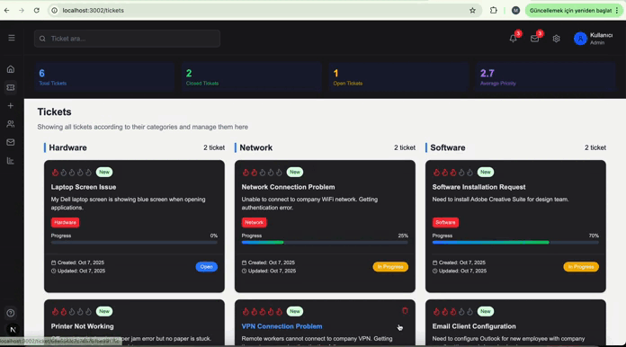

# 🚀 Next.js Full-Stack Ticket Management System 
Built an entire full-stack application using Next.js 14 for both frontend and backend development. No separate backend framework needed - Next.js handled everything!

# ✨ Features:
📊 Dashboard with real-time statistics

🎫 Create, edit, and delete tickets

📱 Fully responsive design

🎨 Modern UI/UX with dark theme

🔄 Real-time updates

📈 Progress tracking

🏷️ Category and priority management

🔍 Search functionality

# 🛠️ Full-Stack Tech Stack:
Next.js 14 (App Router) - Frontend & Backend

Next.js API Routes - Server-side logic

Next.js Server Actions - Form handling

MongoDB + Mongoose

TypeScript

Tailwind CSS

Lucide Icon

# The beauty of Next.js: 
One framework, complete full-stack solution! Built the entire application - from database models to UI components - all within Next.js ecosystem.

This project showcases how Next.js enables rapid full-stack development with seamless frontend-backend integration.

# The preview of the project

